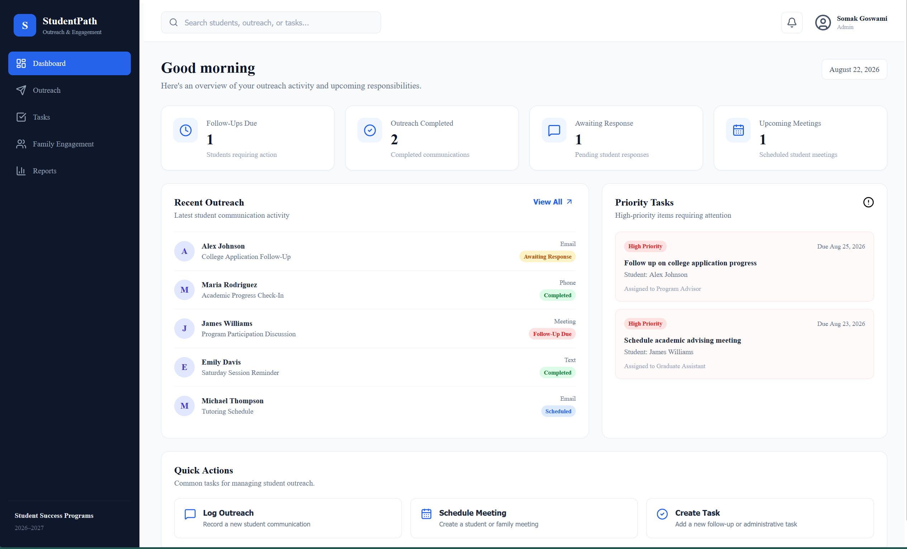
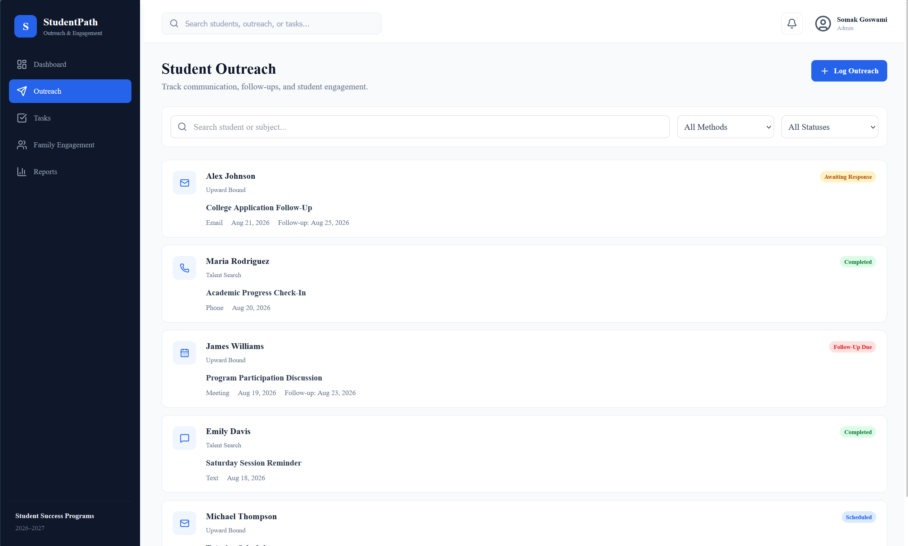
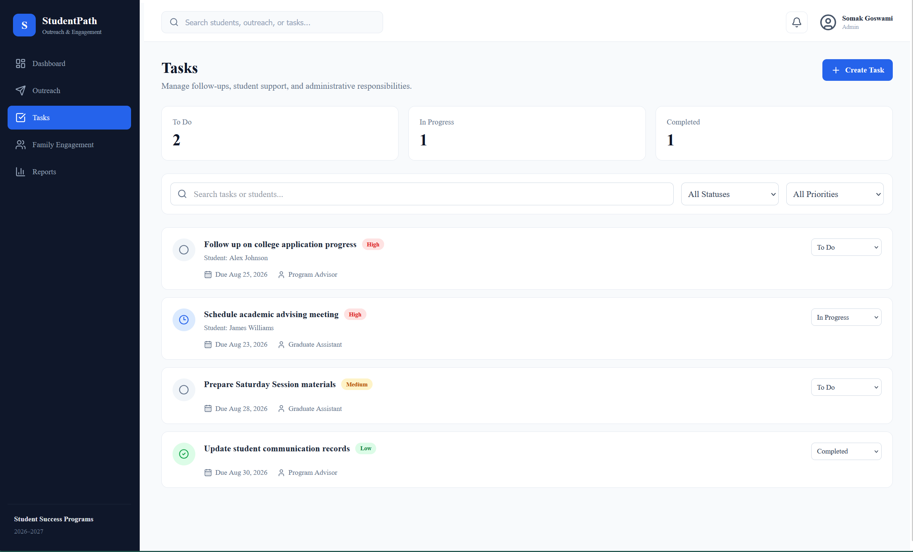
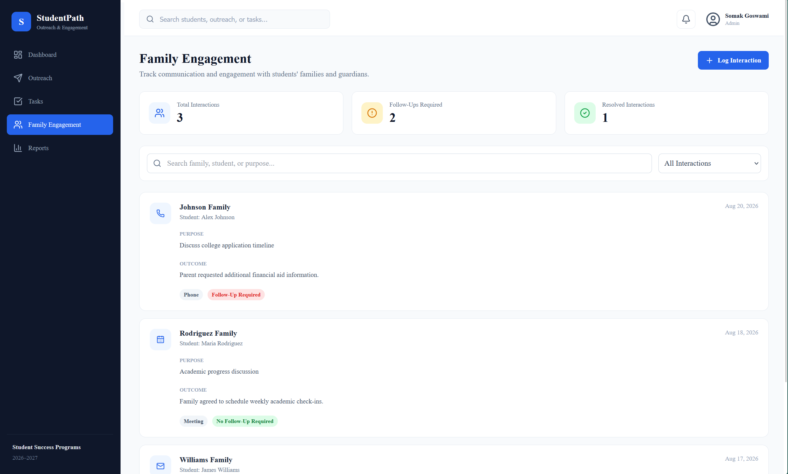
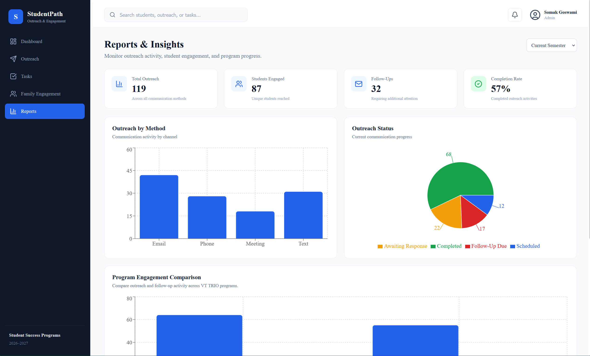

## Student Outreach & Engagement Management Platform

StudentPath is a modern web application designed to help student success teams manage student communication, outreach activities, follow-ups, tasks, family engagement, and program-level insights from a centralized dashboard.

The platform provides an organized workflow for tracking student interactions and identifying follow-ups that require attention.

---

## 📸 Screenshots

### 🏠 Dashboard



The dashboard provides an overview of outreach activity, upcoming responsibilities, priority tasks, and recent student communication.

---

### 📬 Outreach Management



Track and manage student communication across multiple channels including email, phone calls, meetings, and text messages.

---

### ✅ Task Management



Create, organize, and track follow-up tasks and administrative responsibilities with priority and status indicators.

---

### 👨‍👩‍👧 Family Engagement



Record interactions with families and guardians, document communication outcomes, and identify required follow-ups.

---

### 📊 Reports & Insights



Analyze outreach activity, communication methods, engagement progress, follow-ups, and program-level metrics through interactive data visualizations.

---

## ✨ Features

### 📊 Interactive Dashboard

- Overview of student outreach activity
- Follow-ups requiring attention
- Completed outreach tracking
- Pending student responses
- Upcoming meetings
- Recent outreach activity
- High-priority task monitoring
- Quick action navigation

### 📬 Outreach Management

- Log student communications
- Track communication methods
- Monitor outreach status
- Search and filter outreach records
- Track follow-ups
- Manage communication history

Supported communication methods include:

- Email
- Phone
- Meeting
- Text

### ✅ Task Management

- Create follow-up tasks
- Assign priorities
- Track task status
- Associate tasks with students
- Monitor due dates
- Identify high-priority responsibilities

### 👨‍👩‍👧 Family Engagement

- Record family and guardian interactions
- Track communication methods
- Document interaction purposes
- Record communication outcomes
- Identify interactions requiring follow-up
- Search and filter engagement records

### 📈 Reports & Analytics

Interactive reports provide insights into:

- Outreach activity by communication method
- Outreach completion status
- Student engagement metrics
- Follow-up activity
- Program engagement comparisons

---

## 🛠️ Tech Stack

| Technology | Purpose |
|---|---|
| React | Frontend UI development |
| TypeScript | Type-safe application development |
| Vite | Development environment and build tooling |
| React Router | Client-side routing |
| Recharts | Interactive data visualization |
| Lucide React | Application icons |
| CSS | Responsive UI styling |

---

## 🏗️ Project Structure

```text
StudentPath/
│
├── public/
│
├── screenshots/
│   ├── dashboard.png
│   ├── outreach.png
│   ├── tasks.png
│   ├── family-engagement.png
│   └── reports.png
│
├── src/
│   │
│   ├── components/
│   │   ├── Header.tsx
│   │   ├── Sidebar.tsx
│   │   └── StatCard.tsx
│   │
│   ├── data/
│   │   └── mockData.ts
│   │
│   ├── pages/
│   │   ├── Dashboard.tsx
│   │   ├── Outreach.tsx
│   │   ├── Tasks.tsx
│   │   ├── FamilyEngagement.tsx
│   │   └── Reports.tsx
│   │
│   ├── App.tsx
│   ├── index.css
│   ├── main.tsx
│   └── types.ts
│
├── index.html
├── package.json
├── tsconfig.json
└── README.md
```

## 🚀 Getting Started

### Prerequisites

Make sure you have the following installed:

- Node.js
- npm

### Installation

Clone the repository:

```bash
git clone https://github.com/YOUR_USERNAME/studentpath.git
```

Navigate to the project directory:

```bash
cd studentpath
```

Install dependencies:

```bash
npm install
```

Start the development server:

```bash
npm run dev
```

Open the application in your browser:

```text
http://localhost:5173
```

## 📦 Available Scripts

Run development server

```bash
npm run dev
```

Build for production

```bash
npm run build
```

Preview production build

```bash
npm run preview
```

## 🧩 Application Architecture

StudentPath follows a component-based frontend architecture.

```text
App
│
├── Sidebar
│   ├── Dashboard
│   ├── Outreach
│   ├── Tasks
│   ├── Family Engagement
│   └── Reports
│
├── Header
│
└── Pages
    │
    ├── Dashboard
    │   ├── Stat Cards
    │   ├── Recent Outreach
    │   ├── Priority Tasks
    │   └── Quick Actions
    │
    ├── Outreach
    │   ├── Search
    │   ├── Filters
    │   ├── Outreach Records
    │   └── Interaction Form
    │
    ├── Tasks
    │   ├── Task Filters
    │   ├── Priority Tracking
    │   └── Task Management
    │
    ├── Family Engagement
    │   ├── Family Records
    │   ├── Communication Tracking
    │   └── Follow-Up Management
    │
    └── Reports
        ├── Outreach Analytics
        ├── Status Distribution
        └── Program Insights
```

## 📱 Responsive Design

StudentPath is designed to adapt to different screen sizes.

The interface includes responsive layouts for:

- Desktop
- Tablet
- Mobile devices

CSS media queries are used to adjust:

- Grid layouts
- Dashboard cards
- Charts
- Filters
- Navigation elements
- Data displays

## 📊 Data Visualization

The Reports page uses Recharts to provide interactive visualizations.

Current visualizations include:

### Outreach by Method

A bar chart showing communication activity across:

- Email
- Phone
- Meetings
- Text messages

### Outreach Status

A pie chart visualizing the current distribution of:

- Completed
- Awaiting Response
- Follow-Up Due
- Scheduled

### Program Engagement Comparison

A comparative chart showing:

- Outreach activity
- Required follow-ups
- Engagement across student success programs

## 🔮 Future Improvements

StudentPath currently uses mock data for demonstration purposes.

Future improvements could include:

### Backend Integration

- REST API
- Database integration
- Persistent student records
- Persistent outreach history
- User authentication

### Advanced Features

- Role-based access control
- Automated follow-up reminders
- Calendar integration
- Email integration
- Notification system
- Exportable reports
- CSV and PDF reporting
- Student profile pages
- Real-time analytics

### Infrastructure

- Docker containerization
- CI/CD pipeline
- Cloud deployment
- Automated testing

## 🎯 Motivation

Student success teams often manage communication, follow-ups, tasks, and engagement information across multiple tools and spreadsheets.

StudentPath explores how these workflows can be consolidated into a centralized interface that helps teams:

- Track student communication
- Identify follow-ups requiring attention
- Organize administrative tasks
- Monitor family engagement
- Visualize program activity

The project focuses on creating a clean, intuitive workflow for managing student outreach operations.

## 👨‍💻 Author

**Somak Goswami**

Graduate Student | Electrical & Computer Engineering
Virginia Tech

## 📄 License

This project is intended for educational and portfolio purposes.

---

⭐ If you found this project interesting, consider starring the repository!
